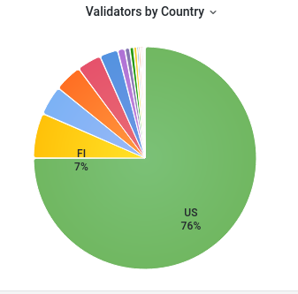

# Connected Validator Info

**What it does**

This script will show information about the validator a Pisces miner is connected to including validator version, ping time and geographic data.

**To Use**
ssh in to your Pisces miner.

Any of the following methods will run the script:
1. /home/admin/connectedvalidator.php
2. ~/connected_validator.php
3. ./connected_validator.php  (requires you to be in the /home/admin directory)

**To Install**

wget https://raw.githubusercontent.com/lt-columbo/pisces_tools/main/connected_validator/install.sh -O - | sudo bash

**If install stalls after you see the line**
Saving to: ‘/home/admin/connected_validator.php’
 
Your system is waiting on the sudo password, type it in. Alternatively before running the above command, run:

sudo ls

which will prompt for the sudo password to run the ls command (list files in directory), and then re-run the wget line above while sudo is still active.

**Distribution of Validators by Country**

From this pie chart you can see that 76% of the miners are in the US. For those outside the US consult the Helium Board page below to determine if you will be able to find a close validator.


source: https://helium.rhinostake.com/d/bgIG1Xt7k/helium-validator-cg-dashboard?orgId=1&refresh=5m

**Ping Times**

Under 100ms are decent, over 200ms, you should consider restarting your miner.
Many Validators are at Amazon Web Services (AWS). AWS blocks ping requests. Use distance to determine possible ping times. 5,000km and under are probably ok. Over 15,000km you should consider restarting miner.

**ASN**

The ASN is number that defines a group of IP addresses and can be used to determine ownership of the IP address block the validator is part of. There is a link included on the GeoIp data that you can copy/paste into a browser to see the name of the company owning the network block of addresses.

# Sample output  
```
Hot Spot Data
ip_address: 24.153.124.106
port: 44158
address: 112rwhWAGpuHdkTSsYqoQWTX8SHQC9hNj
longitude: -79.128
latitude: 30.41
status: online
city: Orlando
state: Florida
country: United States

Validator ip = 135.148.147.56
Pinging 135.148.147.56 ... wait
Average Ping Time = 23ms
Validator Name:  Faint Rusty Sardine

Validator Data
address: 13eDJPELXR5q1gysewvFD5G5nEyRpcryrTVRDdiXc9zLhw2bTHQ
ip_address: 135.148.147.56
port: 2154
name: faint-rusty-sardine
name_standard: Faint Rusty Sardine
owner: 14ex431k7Uf57379AQZGATevZ63sAMEfUukGxX4bd6KYfzjakpT
version: 1.11.0
ping_time: 23ms
ping_time_raw: 23


Validator GeoIP Data
ip_address: 135.148.147.56
organisation: OVH SAS
country: United States
region: Virginia
city: Reston
postal: 20190
latitude: 38.9609
longitude: -77.3429

Distance between hotspot and validator: 358km Ping time: 23ms Version: 1.11.0
```

**GeoIp data**

 [GeoIp data provided by ipapi.co api](https://ipapi.co/api) service. This is free for up to 30000 queries a month.

**Details of what script does**

This script gathers information on the connected validator a Helium hotspot is connected to.
This is useful for seeing how close the validator and hotspot are and how long it takes to
send and receive data. It uses the 
1. docker miner command to get miner address 
2. uses this address to connect to Helium hotspot_for_address api to gather geographic data
3. finds the connected validator ip address using netstat
4. attempts to ping validator and get round trip time. 
5. Searches console log for validator connect message to get validator address
6. Uses Helium validator_for_address api to gather validator data
7. Uses geographic ip data service ipapi.co to attempt to retrieve geographic data for validator ip.
8. Finally displays a summary of this data for you to make a decision on whether to restart the miner with 'sudo docker restart miner' command

A caveat in using this tool is that many validators seem to be located at AWS (Amazon Web Services) and those validators do not respond to ping requests.
