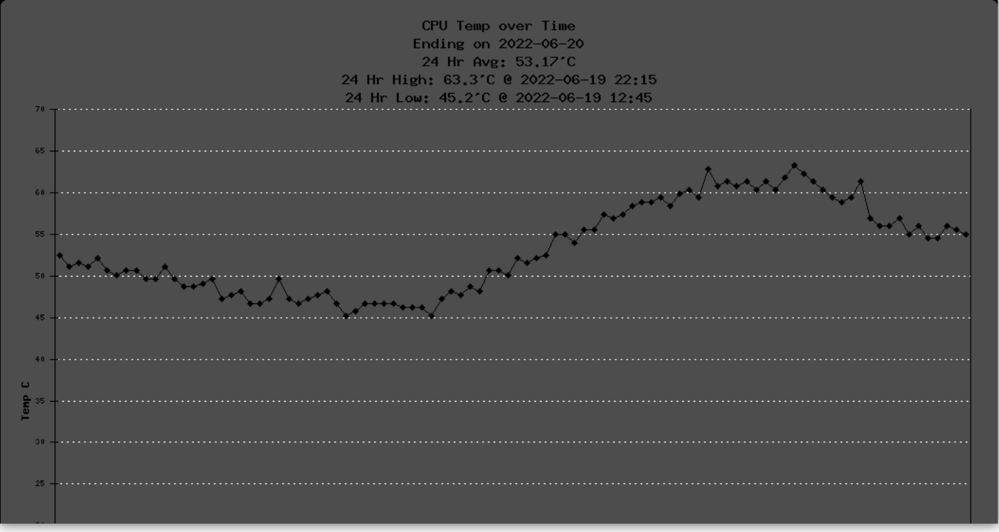

## DO NOT USE YET

## CPU Temp Monitor for Pisces Miners

**What it does**  
This tool will create a scheduled 'cronjob' that will run every 15 minutes sampling the CPU temperature of the Raspberry Pi and capturing into logs.  

**To Install**  
To Install the tool, run the command below in the Pisces Secure Shell (ssh):  
sudo wget https://raw.githubusercontent.com/lt-columbo/pisces_tools/main/cpu_temp_monitor/install.sh

**To Remove**  
To remove the tool, run the command below on your Pisces miner:  
sudo wget https://raw.githubusercontent.com/lt-columbo/pisces_tools/main/cpu_temp_monitor/remove.sh

**NOTE**: The remove tool leaves the logs in place. You must remove these yourself if you no longer want them. That way you won't lose data unless you choose to.  

**To remove the logs manually:**  
sudo rm /var/dashboard/logs/log-cpu-temp.log  
sudo rm /var/dashboard/logs/log-cpu-temp-history.log  

**What are the logs and where are they**  
There are two logs maintained by the tool:
cpu-temp.log - contains the last 24 hours of logs, 96 entries
cpu-temp-history.log - a perpetual log that contains all logged temperature captures.

The logs are stored in the dashboard logs directory at /var/dashboard/logs  

**Format of the logs**  
The files are in csv format and look like this (times are UTC):  
61.3,2022-06-19,21:30  
60.3,2022-06-19,21:45  
61.8,2022-06-19,22:00  
63.3,2022-06-19,22:15  

The first column is sampled temperature in Celcius, second column is date of sample in YYYY-MM-DD format, and third column is time of sample in 24 hour format HH:MM.   

**How to view the logs**  
You may view a graph of the last 24 hours by accessing this url in the Pisces Dashboard:  
https://<your_miner_ip>/graph_cpu_temp.php  

Unfortunately, there are several versions of the dashboard and integrating directly (links in the dashboad) seems unfeasable. Coming soon, I'll supply a patch file for the original briffy dashboard 0.29, you will then be able to apply the patch and view the graph within the Dashboard.

You may also use an editor or the cat/tail tools to echo the values to the ssh shell.  
To show the last 18 entries of the cpu-temp-history.log use:  
tail -18 /var/dashboard/logs/cpu-temp-history.log  
To 'follow' the log (see new entries as they arrive - every 15 minutes):  
tail -f /var/dashboard/logs/cpu-temp-history.log  

You may also export the files by ftp to any place you have access to.

**Sudo Permission Required**  
This script will run as root because the command 'vcgencmd' used to retrieve cpu temperature is a priviledged command, and the dashboard logs directory is protected requiring root.

**Files in this tool**  
/var/dashboard/pages/cpu_temp.php - A Dashboard page to display the cpu temperatures within the Dashboard  
/var/dashboard/public/graph_cpu_temp.php - A script to display the cpu temperature graph without modifying the Dashboard  
/home/admin/log_cpu_temp.php - the cpu temperature logging script run by cron every 15 minutes.  
/var/dashboard/public/includes/phplot.php - the plotting tool used to display the graph  

**Cronjob Added**  
This script adds the following cron entry for root:  
*/15 * * * * /home/admin/log_cpu_temp.php  

**Removal**  
The remove.sh script removes everything installed except the logs and patches you may make to the dashboard.

**Patching Dashboard Is At Your Own Risk**  
If scripts are provided to patch the dashboard, you use at your own risk. You should be experienced enough to undo the change, replace with a backup copy (if available) or grab a new one from briffy dashboard on github.

**Screen Capture of graph_cpu_temp.php Script**  

