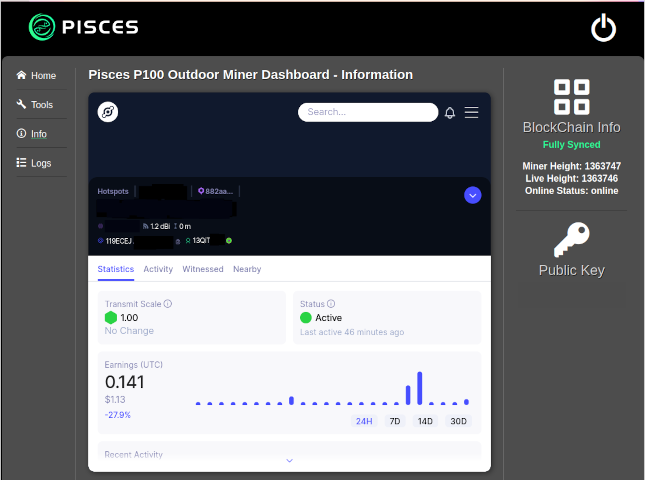
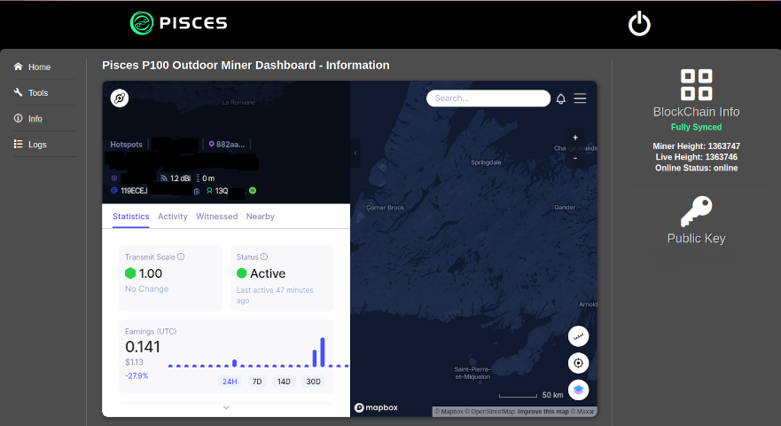

# Pisces Dashboard v0.2.8 and v0.2.9 stylesheet tweek for wide screens

**To Run:**

Open an ssh session to your Pisces Miner and sign in as admin user. Copy/Paste this command in the session:

#### wget https://raw.githubusercontent.com/lt-columbo/pisces_tools/main/dashboard_css_patch/patch_css.sh -O - | sudo bash

**What this patch does**

This patch adds a media query to the end of the css so that when the screen is wider than 768 pixels, the width becomes auto. This allows the dashboard to fill your computer monitor showing wider views of the logs and the info pages. It has no effect on mobile browsers since their width is less than 768 pixels.

**What if you don't like the change**

You may replace the modified common.css file in either of two ways:

1. The patch process makes a copy of your css file before applying the patch. You may revert back to the original css with the following ssh command:
sudo cp /var/dashboard/public/css/common.css.orig /var/dashboard/public/css/common.css

2. A copy of the original common.css from the 0.2.8 dashboard is also contained here in the file [common.css](https://github.com/lt-columbo/pisces_tools/blob/main/dashboard_css_patch/common.css) for you to download with wget[^1] or to copy/paste into an editor.

**No Changes Visible**

Press Ctrl-F5 (PC) Cmd-F5 (Mac) in browser while on the Pisces Dashboard to cause the browser to reload the css file. Or close the browser and reopen.

### Screen Capture of the Dashboard before the patch

### Screen Capture of the Dashboard after the patch

[^1]: To restore the original css for dashboard versions 0.2.8 and 0.2.9 use: sudo wget https://raw.githubusercontent.com/lt-columbo/pisces_tools/main/dashboard_css_patch/common.css -O /var/dashboard/public/css/common.css **THIS IS NOT THE INSTALL LINK**
